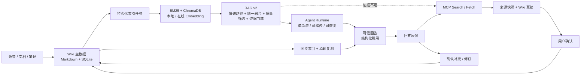

<div align="center">

# 智语 · Zhiyu

**本地优先 AI Wiki，面向可信知识沉淀与可恢复 Agent 执行**

语音、文档和笔记 → 可维护 Wiki → 可信 RAG → 受控研究 → 确认式写入 → 回答纠错与复测

<p>
  
  
  
  
  
</p>

</div>

## 项目定位

智语不是一个只负责“调用大模型回答问题”的聊天页面，而是一套面向个人学习与知识管理的本地优先 AI Wiki：把课堂录音、PDF/DOCX 和零散笔记统一沉淀为可编辑 Markdown 知识库，再通过可追溯 RAG、可恢复 Agent Runtime 和受控 MCP 研究完成知识复用与更新。

项目的核心判断是：知识产品的难点不止在回答质量，还在于正文能否长期维护、证据能否被追溯、执行能否从中断中恢复，以及外部内容能否在用户知情的情况下写回。

## 核心卖点

| 能力 | 实现 | 工程价值 |
| --- | --- | --- |
| **可维护知识主数据** | Markdown 正文 + SQLite 元数据、版本、链接与运行记录 | 文本可读、可迁移、可备份；索引故障不影响正文 |
| **可信 RAG v2** | 查询快速路径、父子分块、批量向量化、并发召回、统一 RRF、单次精排、质量筛选、CRAG、Evidence Gate | 兼顾召回质量、响应延迟、上下文完整性和证据约束 |
| **可复现质量评测** | 私有语料、证据级 Question、四级检索消融与成本统计 | 评测代码公开，原始语料和真实结果保留在本地 |
| **可配置检索模型** | 本地 BGE / OpenAI 兼容 Embedding、独立在线 Rerank、向量空间隔离 | 本地隐私与云端模型能力可按部署条件组合，不污染既有索引 |
| **受限动态 Agent** | 工具能力注册表、JSON Schema、多步骤 DAG、风险策略、结果评估与有限 Replan | 让模型负责规划，让后端掌握执行、预算和权限 |
| **可恢复 Agent Runtime** | 单次真实流、类型化事件、断线续传、取消、超时、终态回放与重启收敛 | 将长流程从 HTTP 连接中解耦，明确失败语义 |
| **受控 MCP 研究** | Search/Fetch 白名单、URL/来源校验、来源快照、研究草稿 | 本地证据不足时可查外部资料，但不自动越权写库 |
| **确认式知识写入** | 预览 → 确认 → 幂等执行 | 防止模型误写、重复确认和网络重试产生副作用 |
| **回答纠错闭环** | 回答反馈、证据快照、研究草稿、确认修订、同步索引、原题复测 | 将一次性问答变成可追踪、可恢复的知识改进流程 |
| **可靠语音采集** | 全格式统一规范化、真实时长探测、同步 ASR 线程隔离、单机去重与本地单并发、三种 Provider | 避免模型推理阻塞事件循环，并在本地隐私、中文转写和云端识别之间切换 |
| **可观测与可恢复** | Request ID、结构化 JSON 日志、阶段时间线、错误码、模型用量、持久化索引任务 | 从前端请求编号定位完整链路，判断慢在哪里、错在哪里、是否可重试 |

## 一眼看懂架构



### 关键数据边界

```text
Markdown + SQLite     业务主数据：需要备份、可直接读取
BM25 + ChromaDB       派生索引：可删除、可从主数据重建
Agent Run / 事件      执行状态：支持续传、终态回放和重启收敛
回答反馈 / 证据快照   纠错状态：支持确认、分阶段重试和原题复测
```

页面写入先校验期望版本并原子保存正文，再在 SQLite 事务中记录版本和索引任务；并发更新返回 `409`，索引失败按退避策略重试。当前 schema 为 `8`，新增会话标题/搜索与回答反馈状态；FastAPI `lifespan` 统一负责迁移、任务恢复和 Worker 启停。

## 技术栈

| 层级 | 技术选型 |
| --- | --- |
| 前端工作台 | React 19、Vite 6、React Markdown、Lucide React、SSE |
| API 与运行时 | Python 3.11、FastAPI、Uvicorn、Pydantic v2、LangGraph |
| 数据与文件 | SQLite、SQLAlchemy 同步 Session、UTF-8 Markdown、YAML Front Matter |
| 混合检索 | BM25、Jieba、ChromaDB、RRF、本地 BGE / OpenAI 兼容 Embedding、本地 BGE / Cohere 兼容 Rerank |
| Agent 与外部研究 | Capability Registry、Plan-and-Execute、有限 Replan、CRAG、MCP Python SDK、OpenAI 兼容模型接口 |
| 多模态采集 | ffmpeg/ffprobe、faster-whisper、DashScope ASR、MiMo-V2.5-ASR、pdfplumber、python-docx |
| 可观测性 | Request ID、JSON 日志轮转、运行追踪工作台、Server-Timing、Langfuse、OpenTelemetry |
| 工程化 | Pytest、GitHub Actions、Docker 多阶段构建 |

> 数据库当前使用 SQLite + 同步 SQLAlchemy；异步主要用于 FastAPI 请求、SSE、Agent/MCP 编排和索引 Worker。这个边界适合单用户本地部署，并为后续迁移 PostgreSQL 与独立任务队列保留空间。

## 目录结构

```text
backend/app/
├── agent/              # 计划、策略、执行器与 LangGraph RAG 状态图
├── api/                # agent / wiki / ingestion / system 路由域
├── core/               # 配置、数据库、生命周期、日志与可观测基础设施
├── models/             # SQLAlchemy 数据模型
└── services/           # ai / retrieval / wiki / memory / research 等领域服务
frontend/
├── src/app/            # React 应用入口与全局编排
├── src/features/       # ask / wiki / capture / observability 功能域
├── src/shared/         # API 客户端与通用组件
└── legacy/             # 不参与主应用构建的旧静态页面
test/
├── unit/               # 按业务域组织的确定性测试
├── integration/        # 真实 FastAPI、SQLite 与跨服务契约测试
└── eval/               # RAG 数据准备、指标实现与评测测试
```

业务代码按领域归档，API 只负责协议适配，跨资源事务留在 Service，通用基础设施集中在 `core`；测试目录镜像业务边界，便于从故障模块直接定位对应测试。

## 语音采集链路

```text
WAV / MP3 / FLAC / OGG / WebM
  → ffprobe 校验真实时长
  → ffmpeg 统一为 16kHz、单声道、16-bit PCM WAV
  → 复检时长与转换后大小
  → asyncio.to_thread 隔离同步 Provider
  → Whisper / DashScope / MiMo
  → 统一转写结果 → 可编辑笔记 → Wiki
```

ASR 调度层对同一 `audio_id` 做进程内运行去重，重复提交返回冲突；本地 Whisper 只允许一个实际推理任务运行。接口超时或客户端断开后，底层同步线程可能无法立即中止，因此占用标记与 Whisper 并发槽会保留到真实调用结束，避免后台残留推理与新请求重叠。Provider 异常只在服务端日志中记录，前端返回稳定的脱敏错误。

| Provider | 适用场景 | 当前边界 |
| --- | --- | --- |
| 本地 Whisper | 隐私优先、离线使用、需要片段时间戳 | 单并发，速度取决于本机 CPU/GPU |
| DashScope | 中文课堂和在线转写 | 依赖外部服务与网络，保留句子时间戳 |
| Xiaomi MiMo-V2.5-ASR | 中英、方言、噪声及远场录音 | 规范化 WAV 以 Base64 发送，编码后上限 10 MB；官方非流式响应不提供片段时间戳 |

三种实现遵循相同的内部结果契约，路由不包含厂商协议。`ASR_PROVIDER` 只设置默认项，React 前端会读取后端 Provider 状态并禁用未配置选项；启用 MiMo 时需要在本地 `.env` 设置 `MIMO_ASR_API_KEY` 和对应的 `MIMO_ASR_API_URL`，密钥不进入版本控制。Token Plan 的 `tp-` Key 必须使用套餐页面提供的专属 Base URL；按量计费的 `sk-` Key 才使用公共 `https://api.xiaomimimo.com/v1` 地址。

## RAG 链路

```text
用户查询
  → 简单、单轮、无指代的只读问题：Fast Path，跳过 Planner 与 Query Rewrite
  → 复杂问题：Planner + Query Rewrite，生成独立查询与多视角查询
  → 多查询一次批量 Embedding，BM25 / ChromaDB 并发召回
  → 子块折叠为稳定父块
  → 所有候选统一 RRF，保留 12 条
  → 独立查询单次 Reranker，最多返回 5 条
  → 最低分数 + 相对分差质量筛选
  → Token Budget 上下文装配
  → Fast Path 高置信证据直接生成；其余结果进入 CRAG 逐证据评分与覆盖度裁决
  → support 注入 / limited_support 对照精炼 / incorrect 丢弃
  → Fast Path 低证据时最多恢复一次完整 Query Rewrite
  → Evidence Gate
  → 带引用回答 / 证据不足拒答
```

Fast Path 只接受无会话上下文、长度不超过 `FAST_PATH_MAX_QUERY_CHARS`、带问题词或问号、且不包含写入/删除/总结以及比较、同时等复杂表达的只读问题。它仍然进入 LangGraph RAG、Rerank 和 Evidence Gate，不是绕过证据约束；只有已有 Rerank 分数达到 `FAST_PATH_RERANK_MIN_SCORE` 且来源数足够时才跳过 CRAG。若 Fast Path 的 CRAG 结果为 `incorrect`，状态会关闭快速标记并恢复一次完整 Query Rewrite，恢复后仍不相关则结束并拒答。

复杂、多轮或带指代的问题保留完整 Agent 链路。Query Rewrite 在一次 LLM 调用中复用会话上下文和 Planner 语义，先完成指代消解，再生成多视角检索表达；多查询向量一次批量生成，BM25 和 ChromaDB 召回并发执行，随后统一融合并只调用一次 Reranker。

Rerank 后不直接把固定数量的结果交给生成模型：系统同时使用最低分数和相对最高分差过滤明显低相关候选，并始终保留最高分结果供证据门禁判断。其余结果由 CRAG 基于原问题、独立查询、Planner 语义、候选来源和有限正文，在一次 Function Calling 中为最多 5 个候选生成完整且唯一的逐文档 `evidence score`，同时判断直接证据是否覆盖问题全部核心部分。后端不采用模型自报的整体 `grade`：默认 `>= 0.7` 标记为 `support`、`<= 0.3` 标记为 `incorrect`、中间区间标记为 `limited_support`；整体覆盖度独立使用 `complete`、`incomplete` 和 `none`。完整覆盖时只把 support 注入生成上下文，覆盖不足时由 support 对照 limited_support 做受限精炼，incorrect 始终丢弃。漏评分、重复或越界 `doc_id`、非法分数、结构化输出失败及模型不可用均 fail closed，禁止直接生成。Evidence Gate 仍独立使用真实 Rerank 分数和来源数控制是否允许生成。

子块用于提高召回粒度，父块用于精排、上下文和稳定引用。回答中的来源保留页面、版本、章节和稳定 Chunk ID；音频页面额外支持转写时间范围回溯。查询向量、检索结果和 CRAG 判断分别使用线程安全的进程内 LRU/TTL 缓存：查询向量按 Provider、模型与查询隔离，检索结果按查询、原始独立查询、索引 collection count/generation 和筛选配置隔离，CRAG 按问题、Planner 语义、阈值及前 5 个证据的 ID/revision/分数/正文哈希隔离；默认 TTL/容量分别为 `60 秒/256 项`、`20 秒/128 项` 和 `60 秒/128 项`。缓存只优化单进程短期重复请求，不是持久状态。

父块采用 `1200/120`，子块采用 `500/80`；BM25 与 Embedding 每个查询分别召回 20 条，统一 RRF 后保留 12 条进入 Rerank，最终上下文最多 5 个父块，并受 3000 Token 预算约束。Rerank 筛选默认最低分为 `0.35`，与最高分的允许差值为 `0.20`；这些参数是面向当前中文技术 Markdown 语料的工程基线，不宣称算法最优。项目提供证据级 Golden Dataset 生成器和 BM25、Embedding、RRF、Rerank 四级消融入口；私有语料、生成问题和真实报告位于被 Git 忽略的 `data/eval/`，公开仓库仅保留方法、代码与小型示例。

### 本地与在线检索模型

Embedding 和 Rerank 保留相同的内部调用契约，可以分别选择本地或在线实现。默认配置继续使用本地模型；接入模型网关时只需修改 `.env`，RAG、Agent 和索引任务无需改代码。

```env
EMBEDDING_PROVIDER=openai_compatible
EMBEDDING_API_URL=https://your-gateway.example.com/v1
EMBEDDING_API_KEY=your_api_key
EMBEDDING_MODEL=text-embedding-3-large
EMBEDDING_DIMENSIONS=1024

RERANKER_PROVIDER=rerank_compatible
RERANKER_API_URL=https://ai-gateway.vercel.sh/v1/rerank
RERANKER_API_KEY=your_vercel_ai_gateway_key
RERANKER_MODEL=cohere/rerank-v4-fast
```

Agent 的四个 LLM 阶段也可以独立配置。当前 Vercel AI Gateway 基线选择低延迟、支持工具调用的模型：Planner/CRAG/Responder 使用 `openai/gpt-4.1-mini`，Query Rewrite 使用更轻量的 `openai/gpt-4.1-nano`。Embedding 仍使用 `alibaba/qwen3-embedding-8b`、Rerank 仍使用 `cohere/rerank-v4-fast`，切换 Embedding 前必须重建索引。

在线 Embedding 使用批量 OpenAI Embeddings 协议，查询侧会先命中短 TTL 缓存；`rerank_compatible` 使用 Cohere/Jina 风格的 `query + documents + top_n` 协议，可直连 Vercel AI Gateway、Jina 或 SiliconFlow，并将响应统一为 `index + score`。`RERANKER_API_URL` 必须填写包含 `/v1/rerank` 的完整地址。不同在线 Embedding 网关、模型或维度会自动使用独立 Chroma 集合，切换后需要在知识库执行一次“重建索引”。系统不会在 Embedding 失败时静默切换模型，因为索引向量与查询向量必须来自同一语义空间；Rerank 可以独立更换，不需要重建索引。

## 分层上下文策略

智语不把所有历史消息直接拼接给模型，而是使用统一 `ContextAssembler` 分层装配。保留优先级为系统约束、长期摘要、当前任务、近期消息；发送给模型时仍保持“历史在前、当前问题在后”的对话顺序：

```text
系统约束 / 工具 Schema
  → 长期对话摘要
  → Token 预算内的近期消息
  → 当前查询与 RAG / 工具证据
  → 输出 Token 预留
```

会话在未摘要消息达到 10 条或估算超过 4,000 Token 时增量压缩，保留最近 5 条消息，原始消息始终保留在 SQLite。摘要使用用户目标、已确认事实、页面与实体、约束偏好、已完成事项和未完成事项等固定栏目。默认模型窗口为 16,000 Token，长期摘要预算为 600 Token，近期对话预算为 3,000 Token；RAG 和工具结果先按各自预算筛选，再由总装配器做最终上限控制。

每次装配只记录各区块的估算 Token、截断状态和被丢弃的近期消息数量，不采集正文，便于定位上下文溢出而不扩大敏感内容暴露面。

## 日志追踪与错误定位

每个 HTTP 请求和独立 Agent Run 都分配稳定 Request ID，并将查询改写、召回、融合、精排、证据判断和生成阶段串成同一条时间线。前端“运行追踪”工作台可以查看近期请求、阶段耗时、错误码、重试属性及模型调用摘要；服务重启后仍可从 SQLite 中读取 Agent 终态快照。

终端输出适合开发时实时观察，`data/logs/app.log` 保存单行 JSON 运行日志，`data/logs/error.log` 单独保存错误并按大小轮转。日志字段包括 `request_id`、`component`、`operation`、`error_code` 和 `duration_ms`，模型密钥、Prompt、Wiki 正文、转写全文及外部网页内容不会写入日志。追踪查询默认只允许本机访问，远程部署需要先补充鉴权再显式开放。

## Agent 与 MCP 安全闭环

Agent 采用能力注册表驱动的受限 Plan-and-Execute。每个工具声明用途、参数 JSON Schema、风险等级、是否需要确认和是否允许并行；Planner 只看到当前阶段允许的能力，并生成最多 6 步的结构化 DAG。后端随后校验工具白名单、参数、步骤引用和循环依赖，再根据实际工具风险决定执行路径，而不是信任模型声明的 Intent。Planner 和 Responder 共享分层上下文装配策略，长期摘要不会因最近消息切片而丢失。

```text
用户目标 → 能力目录 → LLM 结构化 Plan
→ Schema / DAG / 权限校验
→ 写入或删除：持久化完整计划并等待确认
→ 纯检索：简单查询走快速路径，复杂查询由 LangGraph 执行 Query Rewrite / CRAG / Evidence Gate
→ 其他只读计划：Executor → Evaluator → 最多一次 Replan → Respond
```

Executor 按依赖关系构造执行波次，只并行运行显式声明可并行的工具。失败、空结果或工具内部失败可触发一次受预算约束的 Replan；相同计划签名不会重复执行，重规划若产生写入或删除步骤会重新进入确认门禁。已确认的写计划失败后不会自动换计划，避免执行超出用户确认范围的副作用。

Agent Run 不依赖浏览器连接存活：模型只生成一次，增量片段同时用于展示和最终答案组装；事件带严格递增序号，断线可从最后序号续传。取消、总超时和服务重启都会收敛到明确终态，重复确认直接返回首次结果。

外部研究是本地证据不足后的显式分支：

```text
本地证据不足 → 用户触发研究 → 白名单 Search / Fetch
→ URL 与正文校验 → 来源快照与 Wiki 草稿
→ 用户确认 → PageService 写入 → 异步索引
```

应用只调用部署时配置的工具，拒绝本机/私网/保留地址、凭证 URL 和非 HTTP(S) 协议；外部正文作为不可信证据隔离，不能把网页指令当作 Agent 指令执行。研究结果不会自动创建页面。

已完成回答还可以进入持续纠错闭环：

```text
标记知识缺失 / 内容过期 / 引用错误 / 回答不相关
→ 保存原问题、回答、引用与检索统计快照
→ MCP 外部研究 → 生成补充页面或既有页面修订草稿
→ 用户确认 → 写入 Wiki → 同步索引
→ 使用原问题启动新 Run → 保存复测回答与新检索快照
```

反馈以原回答的 Request ID 保证幂等；内容过期只能修订该回答实际引用的页面。写入、索引和复测分别持久化状态，索引或复测失败只重试当前阶段，不重复执行已经完成的页面写入。历史会话按首条用户消息生成标题，可按标题或消息正文搜索并恢复完整消息、引用和待确认状态；Wiki 搜索同时覆盖标题、标签与 Markdown 正文。

## 快速开始

环境要求：Python 3.11+、Node.js 20+、ffmpeg，以及本地 Embedding/Reranker 模型或相应服务配置。

```bash
conda create -n zhiyu python=3.11 -y
conda activate zhiyu
conda install -c conda-forge ffmpeg -y
pip install -r requirements.txt

cd frontend
npm install && npm run build
cd ..

cp .env.example .env
python main.py
```

应用默认运行在 `http://127.0.0.1:8337`，开发前端可在 `frontend` 目录运行 `npm run dev`。模型路径和 API 配置见 [.env.example](.env.example)；不配置模型时，页面管理等非模型能力仍可使用。

API Key 只保存在未纳入版本控制的 `.env` 中。启用在线 Embedding 或 Rerank 意味着查询和候选正文会发送到配置的服务端点，应只使用受信任的模型网关。

## 验证与边界

```bash
python -m pytest -q
python -m pip check

cd frontend
npm run build
npm audit --omit=dev
```

当前自动化测试覆盖页面 `409` 冲突、索引失败重试与重启恢复、RAG v2、计划 Schema 与 DAG 校验、风险确认、有限 Replan、分层上下文装配、Token 触发摘要、Agent 事件顺序与断线回放、取消、超时、重复确认、模型故障转移、MCP 安全边界、备份恢复和音频溯源；新增覆盖回答快照与自动复测、重复反馈幂等、草稿失败恢复、索引分阶段重试、会话/正文搜索、在线 Embedding/Rerank 协议适配、ASR 去重/超时/单并发、MiMo 协议映射、Provider 错误脱敏、向量集合隔离及 schema v5-v7 到 v8 的迁移。请以当前提交实际执行上述命令的结果作为验证基线。

当前后端验证基线为 `119 passed, 5 subtests passed`。

当前面向单用户、本机或可信内网部署，不包含多租户认证、细粒度权限、分布式任务调度和多实例 Agent/ASR 状态共享。ASR 去重与并发限制只在当前进程有效，HTTP 请求仍会等待转写完成；长录音或多实例部署应进一步迁移到持久化任务队列。生产化时还需要根据负载迁移 PostgreSQL、共享运行状态和权限审计体系。

## 项目文档

- [系统架构](docs/architecture/overview.md)
- [日志与运行追踪](docs/runbooks/observability.md)
- [RAG 评测设计](docs/eval/01-evaluation-design.md)
- [RAG 评测流程](docs/eval/02-evaluation-workflow.md)
- [RAG 结果记录模板](docs/eval/03-evaluation-results.md)
- [评测代码说明](test/eval/README.md)
- [Markdown 主数据决策](docs/adr/0001-markdown-source-of-truth.md)
- [持久化索引任务决策](docs/adr/0002-persistent-index-tasks.md)
- [可信 Agent 决策](docs/adr/0003-trusted-agent.md)
- [受控 MCP 研究决策](docs/adr/0004-controlled-mcp-research.md)
- [可配置检索模型决策](docs/adr/0005-configurable-retrieval-models.md)

## License

[MIT License](LICENSE)
