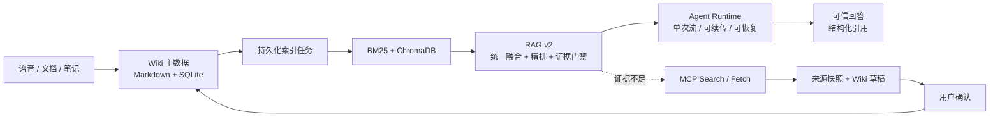

<div align="center">

# 智语 · Zhiyu

**本地优先 AI Wiki，面向可信知识沉淀与可恢复 Agent 执行**

语音、文档和笔记 → 可维护 Wiki → 可信 RAG → 受控研究 → 确认式写入

<p>
  
  
  
  
  
</p>

</div>

## 项目定位

智语不是一个只负责“调用大模型回答问题”的聊天页面，而是一套面向个人学习与知识管理的本地优先 AI Wiki：把课堂录音、PDF/DOCX 和零散笔记统一沉淀为可编辑 Markdown 知识库，再通过可追溯 RAG、可恢复 Agent Runtime 和受控 MCP 研究完成知识复用与更新。

项目的核心判断是：知识产品的难点不止在回答质量，还在于正文能否长期维护、证据能否被追溯、执行能否从中断中恢复，以及外部内容能否在用户知情的情况下写回。

## 核心卖点

| 能力 | 实现 | 面试可讲的工程价值 |
| --- | --- | --- |
| **可维护知识主数据** | Markdown 正文 + SQLite 元数据、版本、链接与运行记录 | 文本可读、可迁移、可备份；索引故障不影响正文 |
| **可信 RAG v2** | 父子分块、多查询统一 RRF、单次精排、Token 预算、CRAG、Evidence Gate | 兼顾召回精度、上下文完整性和证据约束 |
| **可恢复 Agent Runtime** | 单次真实流、类型化事件、断线续传、取消、超时、终态回放与重启收敛 | 将长流程从 HTTP 连接中解耦，明确失败语义 |
| **受控 MCP 研究** | Search/Fetch 白名单、URL/来源校验、来源快照、研究草稿 | 本地证据不足时可查外部资料，但不自动越权写库 |
| **确认式知识写入** | 预览 → 确认 → 幂等执行 | 防止模型误写、重复确认和网络重试产生副作用 |
| **可观测与可恢复** | Request ID、阶段时间线、检索统计、模型用量、持久化索引任务 | 能定位慢在哪里、错在哪里、恢复从哪里继续 |

## 一眼看懂架构



### 关键数据边界

```text
Markdown + SQLite     业务主数据：需要备份、可直接读取
BM25 + ChromaDB       派生索引：可删除、可从主数据重建
Agent Run / 事件      执行状态：支持续传、终态回放和重启收敛
```

页面写入先校验期望版本并原子保存正文，再在 SQLite 事务中记录版本和索引任务；并发更新返回 `409`，索引失败按退避策略重试。当前 schema 为 `6`，FastAPI `lifespan` 统一负责迁移、任务恢复和 Worker 启停。

## 技术栈

| 层级 | 技术选型 |
| --- | --- |
| 前端工作台 | React 19、Vite 6、React Markdown、Lucide React、SSE |
| API 与运行时 | Python 3.11、FastAPI、Uvicorn、Pydantic、LangGraph |
| 数据与文件 | SQLite、SQLAlchemy 同步 Session、UTF-8 Markdown、YAML Front Matter |
| 混合检索 | BM25、Jieba、BGE Embedding、ChromaDB、RRF、BGE Reranker |
| Agent 与外部研究 | Plan-and-Execute、CRAG、MCP Python SDK、OpenAI 兼容模型接口 |
| 多模态采集 | faster-whisper、DashScope ASR、pdfplumber、python-docx |
| 可观测性 | Request ID、Server-Timing、Langfuse、OpenTelemetry |
| 工程化 | Pytest、GitHub Actions、Docker 多阶段构建 |

> 数据库当前使用 SQLite + 同步 SQLAlchemy；异步主要用于 FastAPI 请求、SSE、Agent/MCP 编排和索引 Worker。这个边界适合单用户本地部署，并为后续迁移 PostgreSQL 与独立任务队列保留空间。

## RAG 链路

```text
Query Rewrite
  → 多查询 BM25 / Embedding 召回
  → 子块折叠为稳定父块
  → 所有候选统一 RRF
  → 单次 Reranker
  → Token Budget 上下文装配
  → CRAG 质量判断
  → Evidence Gate
  → 带引用回答 / 证据不足拒答
```

子块用于提高召回粒度，父块用于精排、上下文和稳定引用。多查询结果先汇总再融合和精排，避免为每个改写查询重复执行整条链路。回答中的来源保留页面、版本、章节和稳定 Chunk ID；音频页面额外支持转写时间范围回溯。

## Agent 与 MCP 安全闭环

Agent Run 不依赖浏览器连接存活：模型只生成一次，增量片段同时用于展示和最终答案组装；事件带严格递增序号，断线可从最后序号续传。取消、总超时和服务重启都会收敛到明确终态，重复确认直接返回首次结果。

外部研究是本地证据不足后的显式分支：

```text
本地证据不足 → 用户触发研究 → 白名单 Search / Fetch
→ URL 与正文校验 → 来源快照与 Wiki 草稿
→ 用户确认 → PageService 写入 → 异步索引
```

应用只调用部署时配置的工具，拒绝本机/私网/保留地址、凭证 URL 和非 HTTP(S) 协议；外部正文作为不可信证据隔离，不能把网页指令当作 Agent 指令执行。研究结果不会自动创建页面。

## 快速开始

环境要求：Python 3.11+、Node.js 20+、ffmpeg，以及本地 Embedding/Reranker 模型或相应服务配置。

```bash
conda create -n zhiyu python=3.11 -y
conda activate zhiyu
conda install -c conda-forge ffmpeg -y
pip install -r requirements.txt

cd frontend
npm install && npm run build
cd ..

cp .env.example .env
python main.py
```

应用默认运行在 `http://127.0.0.1:8337`，开发前端可在 `frontend` 目录运行 `npm run dev`。模型路径和 API 配置见 [.env.example](.env.example)；不配置模型时，页面管理等非模型能力仍可使用。

## 验证与边界

```bash
python -m pytest -q
python -m pip check

cd frontend
npm run build
npm audit --omit=dev
```

当前验证覆盖页面 `409` 冲突、索引失败重试与重启恢复、RAG v2、Agent 事件顺序与断线回放、取消、超时、重复确认、模型故障转移、增量摘要、MCP 安全边界、备份恢复和音频溯源。已验证基线为后端 `42 passed`、依赖检查通过、React 构建通过、生产依赖审计 0 漏洞。

当前面向单用户、本机或可信内网部署，不包含多租户认证、细粒度权限、分布式任务调度和多实例 Agent 状态共享。生产化时需要根据负载迁移 PostgreSQL、共享运行状态、独立任务队列和权限审计体系。

## 项目文档

- [系统架构](docs/architecture.md)
- [Markdown 主数据决策](docs/adr/0001-markdown-source-of-truth.md)
- [持久化索引任务决策](docs/adr/0002-persistent-index-tasks.md)
- [可信 Agent 决策](docs/adr/0003-trusted-agent.md)
- [受控 MCP 研究决策](docs/adr/0004-controlled-mcp-research.md)

## License

[MIT License](LICENSE)
