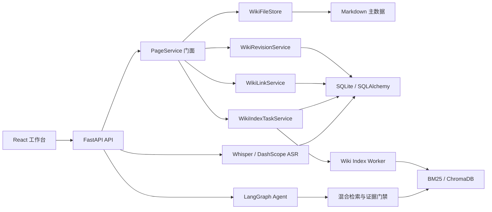

# 智语架构说明

## 目标与边界

智语面向单用户、本地优先的课堂知识管理场景。系统优先保证知识可读、可迁移和可恢复；模型、向量索引和后台任务均不得成为页面写入的单点故障。

当前不解决多租户、高并发写入和跨节点任务调度。需要这些能力时，可将 SQLite、进程内 Worker 和本地文件存储分别迁移到 PostgreSQL、独立任务队列和对象存储。

## 模块结构



`PageService` 只负责编排跨资源事务和提供稳定 API；文件、版本、链接和索引任务由独立服务承担。ChromaDB 和 BM25 均为派生数据，可以从 Markdown 与 SQLite 元数据重建。

## 页面写入

1. 校验标题、正文、版本号和页面 ID。
2. 原子写入带 YAML Front Matter 的 Markdown。
3. 在同一数据库事务中保存元数据、完整版本快照和索引任务。
4. 重建 Wiki Link 与反向链接。
5. API 立即返回，后台 Worker 异步更新 BM25 和 ChromaDB。

数据库提交失败时恢复原 Markdown；模型不可用时保留主数据并将任务置为 `failed`，按指数退避重试。

## 可信问答

```text
Plan → Query Rewrite → BM25 / Embedding → RRF → Reranker
     → CRAG Grade → Evidence Gate → Generate
```

证据门禁在生成前执行。无结果、来源不足或分数低于阈值时返回结构化拒答，不调用 LLM 生成推测性答案。每个来源保留页面、版本、章节、稳定 Chunk ID；课堂音频页面额外返回转写时间范围和媒体链接。

## Agent 写入

写操作采用两阶段协议：首次请求只持久化计划和预览，确认接口才执行工具。完成结果写回 `agent_pending_actions`；重复确认直接返回首次结果，避免重复副作用。

## 生命周期与可观测性

FastAPI `lifespan` 统一执行 schema 迁移、索引恢复、Worker 启动和退出清理。每个 HTTP 请求生成或继承 `X-Request-ID`，最终日志记录查询改写、召回、融合、精排、证据判断和生成耗时；响应同时返回 `Server-Timing`。

## 关键决策

- [ADR-0001：Markdown 作为知识主数据](adr/0001-markdown-source-of-truth.md)
- [ADR-0002：持久化异步索引任务](adr/0002-persistent-index-tasks.md)
- [ADR-0003：证据门禁与确认式 Agent](adr/0003-trusted-agent.md)
