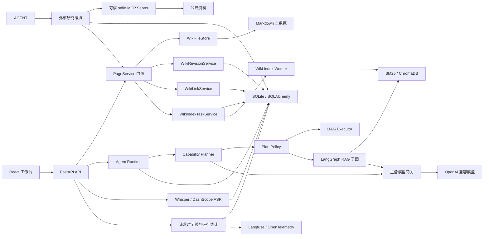

# 智语架构说明

## 目标与边界

智语面向单用户、本地优先的课堂知识管理场景。系统优先保证知识可读、可迁移和可恢复；模型、向量索引和后台任务均不得成为页面写入的单点故障。

当前不解决多租户、高并发写入和跨节点任务调度。需要这些能力时，可将 SQLite、进程内 Worker 和本地文件存储分别迁移到 PostgreSQL、独立任务队列和对象存储。

## 模块结构



`PageService` 只负责编排跨资源事务和提供稳定 API；文件、版本、链接和索引任务由独立服务承担。ChromaDB 和 BM25 均为派生数据，可以从 Markdown 与 SQLite 元数据重建。

核心目录遵循单向依赖和稳定聚合入口：

| 模块 | 职责 | 依赖边界 |
| --- | --- | --- |
| `backend/app/api/agent.py` | 聚合 Agent 子路由 | 不承载业务流程 |
| `backend/app/api/agent_*` | Run、确认、研究、会话和检索协议 | 调用 Agent 与领域服务 |
| `backend/app/services/agent_runtime_service.py` | Run 状态、事件、会话锁和终态持久化 | 不实现具体 Agent 工具 |
| `backend/app/agent/planner.py` | 根据当前能力目录生成结构化多步骤计划 | 不直接执行工具，不决定权限 |
| `backend/app/agent/plan_policy.py` | Schema、依赖、风险、签名与执行结果校验 | 不信任模型声明的 Intent |
| `backend/app/agent/graph.py` | LangGraph 可信 RAG 子图 | 只编排改写、检索、证据和生成 |
| `backend/app/agent/executor.py` | 依赖图、并发波次、取消和结果聚合 | 通过工具注册表执行步骤 |
| `backend/app/agent/tool_registry.py` | 工具能力元数据、参数模型与具体实现 | 通过工厂延迟加载外部依赖 |
| `backend/app/services/context_assembler.py` | 长期摘要、近期消息、当前任务和输出预算的统一装配 | 只返回模型消息与脱敏统计 |
| `backend/app/services/memory_service.py` | 会话消息持久化和增量摘要游标 | 不删除原始对话 |
| `backend/app/services/hybrid_retrieval_service.py` | 召回、融合、精排与上下文装配 | 构造参数可注入，默认使用生产单例 |
| `frontend/app/src/hooks/useAgentRun.js` | SSE、续传、停止、会话与确认状态 | 不负责页面布局 |
| `frontend/app/src/components/AgentMessage.jsx` | 回答、引用、研究和运行详情展示 | 不直接发起 API 请求 |
| `frontend/app/src/views/AskWorkspace.jsx` | 页面编排与输入交互 | 组合 Hook 和展示组件 |

这种拆分保留了原有导入入口与 URL，便于渐进迁移。Planner 负责提出计划，Policy 负责把模型输出收敛为受限 DAG，Executor 只执行已经校验的步骤；LangGraph 不再重复规划，而是作为可信 RAG 的专用状态图。

## 页面写入

1. 校验标题、正文、版本号和页面 ID。
2. 原子写入带 YAML Front Matter 的 Markdown。
3. 在同一数据库事务中保存元数据、完整版本快照和索引任务。
4. 重建 Wiki Link 与反向链接。
5. API 立即返回，后台 Worker 异步更新 BM25 和 ChromaDB。

数据库提交失败时恢复原 Markdown；模型不可用时保留主数据并将任务置为 `failed`，按指数退避重试。

## 可信问答

```text
Plan -> Query Rewrite -> 多查询 BM25 / Embedding 召回
     -> 子块折叠为父块 -> 单次 RRF -> 单次 Reranker
     -> Token Budget -> CRAG Grade -> Evidence Gate -> Generate
```

索引同时保存稳定父块和细粒度子块。子块参与召回，命中后折叠回父块；不同改写查询的稀疏、稠密结果全部收集后只执行一次统一融合和一次精排，避免旧链路为每个查询重复加载候选和精排。最终上下文按 Token 预算装配，最后一个父块允许截断，但来源标识不会丢失。

`RAG_V2_ENABLED` 是总回退开关，关闭后恢复原逐查询完整检索；`RAG_PARENT_CHILD_ENABLED` 可以独立关闭父子分块。CRAG、证据门禁、稳定引用和 MCP 确认流程不受开关影响。

证据门禁在生成前执行。无结果、来源不足或分数低于阈值时返回结构化拒答，不调用 LLM 生成推测性答案。每个来源保留页面、版本、章节、稳定 Chunk ID；课堂音频页面额外返回转写时间范围和媒体链接。

## 外部研究

外部研究是证据门禁后的显式分支，不是检索图的自动回退。用户触发后，模型生成有限数量的检索词，MCP 客户端只连接配置的 stdio Server，并只调用预先声明的搜索和抓取工具。

```text
本地证据不足 -> 用户触发 -> 查询生成 -> MCP 搜索/抓取
-> URL 与内容校验 -> 带引用回答和 Wiki 草稿
-> 用户确认 -> PageService -> 异步索引
```

外部资料经过以下边界后才进入模型：

1. URL 仅允许 HTTP(S)，拒绝凭证、本机、私网、链路本地和保留地址。
2. 来源按规范化 URL 和正文哈希去重，并限制来源数与正文总量。
3. 外部正文被转义并标记为不可信证据，模型不得执行其中的指令。
4. 研究任务和来源快照先写入 SQLite；研究结果不会直接创建页面。
5. 用户确认后，页面通过 `PageService` 写入，并由 `wiki_page_sources` 建立来源关系。

MCP Server 是部署信任边界。应用不会向子进程传递完整环境变量，也不会调用运行时返回的任意工具；Server 自身仍需负责 HTTP 重定向、DNS 重绑定和网络出口控制。

## Agent 写入

工具注册表为每个能力声明参数 Schema、风险级别、确认要求与并行属性。Planner 只能选择当前阶段允许的工具；Policy 校验最大步骤数、参数、步骤引用、依赖完整性和环路，并根据实际工具而非 Intent 计算风险。

写操作采用两阶段协议：包含任意写入或删除步骤的完整计划，首次请求只持久化计划和预览，确认后才执行。完成结果写回 `agent_pending_actions`；重复确认直接返回首次结果，避免重复副作用。只读工具执行失败或返回空结果时最多进行一次 Replan，相同计划签名不会重复执行；重规划产生写工具时重新暂停确认，已确认写计划失败后不自动重规划。

## Agent 运行时

每次流式请求只创建一个模型生成过程。模型流片段同时用于前端输出和最终回答组装，不再为了流式展示重复调用模型。事件统一包含 Run ID、会话 ID、严格递增的序号、时间和类型，覆盖阶段、工具、Token 与终态。

同一会话只允许一个活动 Run。浏览器断线后可从最后事件序号继续订阅；取消使用协作式信号，总超时负责停止后续编排并将状态收敛为 `timed_out`。工具结果的原始值保留给业务与审计，进入模型上下文和步骤引用前才按 Token 预算截断。

活动事件保存在进程内，避免为每个 Token 写 SQLite。Run 进入完成、失败、取消或超时后，运行状态和非 Token 事件批量持久化，终态事件包含完整回答，因此重连不依赖逐 Token 数据。服务重启时，遗留的 `pending`、`running` 和 `cancelling` Run 会标记为失败并补写可回放的终态事件。

当前实现定位于单进程本地部署。Python 线程中的外部 SDK 调用无法被强制终止，只能在调用返回后响应取消信号；总超时保证应用状态收敛和后续步骤停止，不等同于操作系统级线程终止。多实例部署需要将活动状态、事件流和会话锁迁移到共享基础设施。

## 生命周期与可观测性

FastAPI `lifespan` 统一执行 schema 迁移、Agent Run 与索引任务恢复、Worker 启动和退出清理。每个 HTTP 请求生成或继承 `X-Request-ID`，响应返回 `Server-Timing`、Agent 执行时间线、检索统计和模型用量。相同数据脱敏后写入 `agent_runs`，用于复盘单次请求。

LLM 网关记录主模型和备用模型的 Token、耗时与估算成本。仅连接错误、超时、429 和 5xx 可以触发故障转移；流式输出一旦开始就不再切换，避免把两个模型的内容拼接成同一回答。Langfuse 和 OpenTelemetry 默认关闭，正文采集默认关闭，导出异常不会影响请求。

## 对话记忆

会话摘要使用 `summary_message_id` 作为增量游标。未摘要消息达到数量阈值或 Token 阈值后，系统只摘要最近窗口之前且实际进入摘要输入的消息；旧摘要作为输入继续更新，原始 `conversation_messages` 不删除。摘要固定保留用户目标、已确认事实、页面与实体、约束偏好、已完成事项和未完成事项。

`ContextAssembler` 在每次 Planner 和 Responder 调用前统一计算模型输入预算：系统约束优先，其次是长期摘要和当前任务，近期消息从最新向前装配，最后为模型输出预留空间。默认模型窗口为 16,000 Token，近期历史预算为 3,000 Token，摘要预算为 600 Token。RAG 证据和工具结果先经过领域预算筛选，再由总装配器执行最终上限控制。

装配统计只包含总预算、各分区用量、截断状态和丢弃消息数量，不产生额外正文副本。模型 tokenizer 不可用时继续使用中英文混合估算规则，因此预算保留安全余量，不能视为供应商账单 Token 的精确值。

## 关键决策

- [ADR-0001：Markdown 作为知识主数据](adr/0001-markdown-source-of-truth.md)
- [ADR-0002：持久化异步索引任务](adr/0002-persistent-index-tasks.md)
- [ADR-0003：证据门禁与确认式 Agent](adr/0003-trusted-agent.md)
- [ADR-0004：受控 MCP 外部研究](adr/0004-controlled-mcp-research.md)
