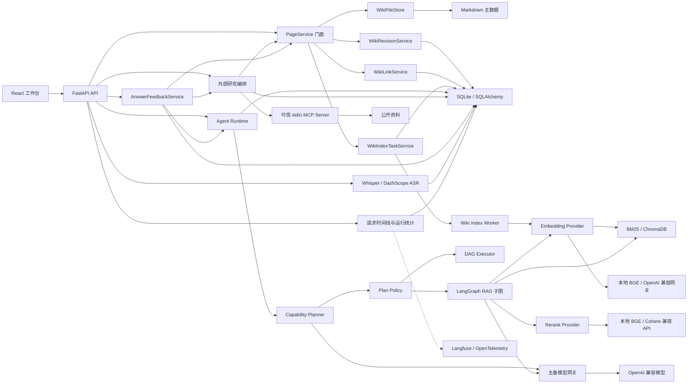

# 智语架构说明

## 目标与边界

智语面向单用户、本地优先的课堂知识管理场景。系统优先保证知识可读、可迁移和可恢复；模型、向量索引和后台任务均不得成为页面写入的单点故障。

当前不解决多租户、高并发写入和跨节点任务调度。需要这些能力时，可将 SQLite、进程内 Worker 和本地文件存储分别迁移到 PostgreSQL、独立任务队列和对象存储。

## 模块结构



`PageService` 只负责编排跨资源事务和提供稳定 API；文件、版本、链接和索引任务由独立服务承担。ChromaDB 和 BM25 均为派生数据，可以从 Markdown 与 SQLite 元数据重建。

核心目录遵循单向依赖和稳定聚合入口：

```text
backend/app/
├── api/          HTTP/SSE 协议适配，按 agent、wiki、ingestion、system 分域
├── agent/        计划生成、策略校验、DAG 执行与可信 RAG 图
├── services/     按 ai、retrieval、wiki、memory、research 等领域组织业务能力
├── models/       持久化模型
└── core/         配置、数据库、生命周期、错误、日志与遥测

frontend/src/
├── app/          应用入口和顶层导航
├── features/     ask、wiki、capture、observability 独立功能域
├── shared/       跨功能 API 客户端与通用组件
└── styles/       全局样式
```

| 模块 | 职责 | 依赖边界 |
| --- | --- | --- |
| `backend/app/api/agent/__init__.py` | 聚合 Agent 子路由 | 不承载业务流程 |
| `backend/app/api/agent/*.py` | Run、确认、研究、会话和检索协议 | 调用 Agent 与领域服务 |
| `backend/app/api/agent/feedback.py` | 回答反馈、草稿准备、确认、重试和取消协议 | 只做参数解析与错误映射 |
| `backend/app/services/runtime/agent_runtime_service.py` | Run 状态、事件、会话锁和终态持久化 | 不实现具体 Agent 工具 |
| `backend/app/services/feedback/answer_feedback_service.py` | 反馈快照、研究、确认写入、同步索引与原题复测状态机 | 复用研究、页面、PendingAction 与 Runtime，不复制执行逻辑 |
| `backend/app/agent/planner.py` | 根据当前能力目录生成结构化多步骤计划 | 不直接执行工具，不决定权限 |
| `backend/app/agent/plan_policy.py` | Schema、依赖、风险、签名与执行结果校验 | 不信任模型声明的 Intent |
| `backend/app/agent/graph.py` | LangGraph 可信 RAG 子图 | 只编排改写、检索、证据和生成 |
| `backend/app/agent/executor.py` | 依赖图、并发波次、取消和结果聚合 | 通过工具注册表执行步骤 |
| `backend/app/agent/tool_registry.py` | 工具能力元数据、参数模型与具体实现 | 通过工厂延迟加载外部依赖 |
| `backend/app/services/memory/context_assembler.py` | 长期摘要、近期消息、当前任务和输出预算的统一装配 | 只返回模型消息与脱敏统计 |
| `backend/app/services/memory/memory_service.py` | 会话消息、标题、正文检索、历史恢复和增量摘要游标 | 不删除原始对话 |
| `backend/app/services/ai/embedding_service.py` | 本地与 OpenAI 兼容 Embedding Provider、批处理与维度校验 | 不决定检索策略，不跨模型自动降级 |
| `backend/app/services/ai/reranker_service.py` | 本地与 Cohere/Jina 兼容 Rerank Provider、响应归一化 | 不直接读取向量库，不改变候选正文 |
| `backend/app/services/retrieval/chroma_service.py` | 持久化向量与 Embedding Profile 集合隔离 | 不把不同语义空间写入同一集合 |
| `backend/app/services/retrieval/hybrid_retrieval_service.py` | 召回、融合、精排与上下文装配 | 构造参数可注入，默认使用生产单例 |
| `frontend/src/features/ask/hooks/useAgentRun.js` | SSE、续传、停止、会话与确认状态 | 不负责页面布局 |
| `frontend/src/features/ask/components/AgentMessage.jsx` | 回答、引用、研究和运行详情展示 | 不直接发起 API 请求 |
| `frontend/src/features/ask/components/AnswerFeedbackPanel.jsx` | 纠错草稿、阶段状态、前后回答与重试交互 | 不实现后端状态机 |
| `frontend/src/features/ask/AskWorkspace.jsx` | 页面编排与输入交互 | 组合 Hook 和展示组件 |

API 聚合入口保持原有 URL 稳定，内部模块则按业务域显式导入。Planner 负责提出计划，Policy 负责把模型输出收敛为受限 DAG，Executor 只执行已经校验的步骤；LangGraph 不再重复规划，而是作为可信 RAG 的专用状态图。

## 页面写入

1. 校验标题、正文、版本号和页面 ID。
2. 原子写入带 YAML Front Matter 的 Markdown。
3. 在同一数据库事务中保存元数据、完整版本快照和索引任务。
4. 重建 Wiki Link 与反向链接。
5. API 立即返回，后台 Worker 异步更新 BM25 和 ChromaDB。

数据库提交失败时恢复原 Markdown；模型不可用时保留主数据并将任务置为 `failed`，按指数退避重试。

## 可信问答

```text
Plan + 会话上下文 -> Query Rewrite -> 独立查询 + 多视角查询
     -> 多查询 BM25 / Embedding 召回 -> 子块折叠为父块
     -> 单次 RRF -> 独立查询单次 Reranker -> Token Budget
     -> CRAG evidence score -> 后端双阈值 Grade -> Evidence Gate -> Generate
```

Query Rewrite 显式接收原问题、会话上下文和 Planner `goal`/`intent`，在一次 LLM 调用中先完成指代消解，再生成多视角查询。索引同时保存稳定父块和细粒度子块。子块参与召回，命中后折叠回父块；不同查询的稀疏、稠密结果全部收集后只执行一次统一融合，并以独立查询完成一次精排，避免旧链路为每个查询重复加载候选和精排。CRAG 显式接收原问题、独立查询、Planner 语义，以及候选标题、来源、Rerank 分数和有限正文；LLM 只生成逐文档 `evidence score`，整体 `grade` 仅保留为诊断字段。后端过滤不合法的文档编号、非数字、非有限值和 `[0,1]` 以外分数，取最高有效分数按 `CRAG_UPPER_THRESHOLD`/`CRAG_LOWER_THRESHOLD` 裁决，默认边界为 `0.7/0.3`；没有有效分数时进入 `ambiguous`。CRAG 分数用于检索纠正，Evidence Gate 则独立使用真实 Rerank 分数和来源数控制生成。最终上下文按 Token 预算装配，最后一个父块允许截断，但来源标识不会丢失。

父块大小、父块重叠、子块大小和子块重叠均由环境变量配置。当前固定采用父块 `1200/120`、子块 `500/80`，最终最多选择 5 个父块并受 3000 Token 预算约束。该配置是中文技术 Markdown 场景下的工程默认值，不通过分块参数网格搜索宣称算法最优；质量由真实文档统一评测集验证。

`RAG_V2_ENABLED` 是总回退开关，关闭后恢复原逐查询完整检索；`RAG_PARENT_CHILD_ENABLED` 可以独立关闭父子分块。CRAG、证据门禁、稳定引用和 MCP 确认流程不受开关影响。

证据门禁在生成前执行。无结果、来源不足或分数低于阈值时返回结构化拒答，不调用 LLM 生成推测性答案。每个来源保留页面、版本、章节、稳定 Chunk ID；课堂音频页面额外返回转写时间范围和媒体链接。

### 检索模型 Provider 与向量边界

`EmbeddingService` 与 `RerankerService` 是检索链路的稳定门面，调用方继续使用 `encode`、`encode_documents` 和 `rerank`；门面根据部署配置选择具体后端：

```text
EmbeddingService -> LocalEmbeddingBackend
                 -> OpenAICompatibleEmbeddingBackend

RerankerService  -> LocalRerankerBackend
                 -> RerankCompatibleBackend
```

在线 Embedding 复用 OpenAI SDK，支持批量输入、可选维度、超时和有限重试。返回向量必须与输入数量一致，且每条向量维度相同；配置了固定维度时，服务端返回维度不一致会直接失败。空文本不会发送给模型，结果按原输入位置补回零向量。

Embedding Profile 由 Provider、API URL、模型名和维度共同确定，API Key 不参与也不会进入集合名。默认本地 Provider 继续使用原 `CHROMA_COLLECTION_NAME`；在线 Profile 使用带哈希后缀的独立集合。因此切换模型不会破坏旧集合，也不会因维度冲突向同一集合写入失败。新集合初始为空，部署者需要显式执行全量重建，系统不会自动产生批量在线调用费用。

Embedding 不设置自动模型降级：即使两个模型维度相同，其语义空间也不兼容，查询侧临时切换会让召回失真。`rerank_compatible` 接受 Cohere/Jina 风格协议，可直连 Vercel AI Gateway、Jina 或 SiliconFlow 的完整 Rerank 地址。Rerank 只读取查询和已经召回的候选正文，可以独立切换，不要求重建向量；不同模型分数分布仍可能不同，证据判断统一使用可配置的 `EVIDENCE_MIN_SCORE`。

在线模型地址只能使用 HTTP(S)，并拒绝在 URL 中嵌入用户名或密码。API Key 只从服务端环境读取，不进入健康检查、集合标识或错误响应；Provider 错误只暴露错误类别或 HTTP 状态码。在线模式会将查询、文档分块或候选正文发送给配置端点，因此端点本身属于部署信任边界。

## 外部研究

外部研究是证据门禁后的显式分支，不是检索图的自动回退。用户触发后，模型生成有限数量的检索词，MCP 客户端只连接配置的 stdio Server，并只调用预先声明的搜索和抓取工具。

```text
本地证据不足 -> 用户触发 -> 查询生成 -> MCP 搜索/抓取
-> URL 与内容校验 -> 带引用回答和 Wiki 草稿
-> 用户确认 -> PageService -> 异步索引
```

外部资料经过以下边界后才进入模型：

1. URL 仅允许 HTTP(S)，拒绝凭证、本机、私网、链路本地和保留地址。
2. 来源按规范化 URL 和正文哈希去重，并限制来源数与正文总量。
3. 外部正文被转义并标记为不可信证据，模型不得执行其中的指令。
4. 研究任务和来源快照先写入 SQLite；研究结果不会直接创建页面。
5. 用户确认后，页面通过 `PageService` 写入，并由 `wiki_page_sources` 建立来源关系。

MCP Server 是部署信任边界。应用不会向子进程传递完整环境变量，也不会调用运行时返回的任意工具；Server 自身仍需负责 HTTP 重定向、DNS 重绑定和网络出口控制。

## 回答纠错闭环

回答纠错不是直接修改一段回复，而是通过持久化状态机改进支撑回答的 Wiki 知识：

```text
reported
  -> researching -> pending_confirmation
  -> writing -> indexing -> retesting -> resolved
       |            |            |
       v            v            v
  write_failed  index_failed  retest_failed
```

用户可标记 `knowledge_missing`、`content_outdated`、`citation_error` 或 `answer_irrelevant`。创建反馈时，服务端根据 Request ID 读取已完成的 `AgentRun`，保存原问题、回答、引用、检索统计和证据状态，不能由前端伪造原回答快照。相同 Request ID 只创建一条反馈，重复提交返回原记录。

草稿准备阶段复用 `ExternalResearchService` 获取受控外部证据：知识缺失、引用错误和回答不相关会形成补充页面；内容过期会基于现有页面与外部证据生成修订稿，并且只能选择原回答实际引用的页面。草稿随后复用 `AgentPendingAction` 等待用户确认，不绕过现有写操作门禁。

确认后，服务先执行页面写入，再同步完成该页面对应的索引任务，最后通过 `AgentRuntimeService` 使用原问题创建新的 Run。写入结果、索引结果、复测 Request ID、复测回答和新检索快照分别持久化。索引失败只重试索引，复测失败只重启复测，已经成功的页面写入不会重复执行。

### 回答反馈 API

所有接口返回 `AnswerFeedbackResponse`，其中 `before` 保存原回答与证据快照，`draft` 保存待确认草稿，`write_result`、`index_result` 和 `retest` 分别描述后续阶段。

| 方法与路径 | 参数 | 行为 |
| --- | --- | --- |
| `POST /agent/feedback/` | `request_id`、`session_id`、`category`，可选 `user_note`、`target_page_id` | 幂等创建反馈并保存服务端可信快照 |
| `GET /agent/feedback/{id}?session_id=...` | 反馈 ID、会话 ID | 查询状态；复测已终止时同步收敛结果 |
| `POST /agent/feedback/{id}/prepare` | `session_id` | 外部研究并生成补充或修订草稿 |
| `POST /agent/feedback/{id}/confirm` | `session_id` | 确认写入、同步索引并启动原题复测 |
| `POST /agent/feedback/{id}/retry` | `session_id` | 仅重试失败的索引或复测阶段 |
| `POST /agent/feedback/{id}/cancel` | `session_id` | 取消仍在等待确认的草稿 |

创建示例：

```json
{
  "request_id": "request-original",
  "session_id": "session-knowledge",
  "category": "content_outdated",
  "user_note": "页面中的版本信息已经过期",
  "target_page_id": "cited-page-id"
}
```

错误按领域语义映射：资源不存在返回 `404`，状态冲突返回 `409`，反馈类型或目标页面不合法返回 `422`，外部研究未配置返回 `503`，研究或纠错编排失败返回 `502`，未分类异常返回 `500`。

## Agent 写入

工具注册表为每个能力声明参数 Schema、风险级别、确认要求与并行属性。Planner 只能选择当前阶段允许的工具；Policy 校验最大步骤数、参数、步骤引用、依赖完整性和环路，并根据实际工具而非 Intent 计算风险。

写操作采用两阶段协议：包含任意写入或删除步骤的完整计划，首次请求只持久化计划和预览，确认后才执行。完成结果写回 `agent_pending_actions`；重复确认直接返回首次结果，避免重复副作用。只读工具执行失败或返回空结果时最多进行一次 Replan，相同计划签名不会重复执行；重规划产生写工具时重新暂停确认，已确认写计划失败后不自动重规划。

## Agent 运行时

每次流式请求只创建一个模型生成过程。模型流片段同时用于前端输出和最终回答组装，不再为了流式展示重复调用模型。事件统一包含 Run ID、会话 ID、严格递增的序号、时间和类型，覆盖阶段、工具、Token 与终态。

同一会话只允许一个活动 Run。浏览器断线后可从最后事件序号继续订阅；取消使用协作式信号，总超时负责停止后续编排并将状态收敛为 `timed_out`。工具结果的原始值保留给业务与审计，进入模型上下文和步骤引用前才按 Token 预算截断。

活动事件保存在进程内，避免为每个 Token 写 SQLite。Run 进入完成、失败、取消或超时后，运行状态和非 Token 事件批量持久化，终态事件包含完整回答，因此重连不依赖逐 Token 数据。服务重启时，遗留的 `pending`、`running` 和 `cancelling` Run 会标记为失败并补写可回放的终态事件。

当前实现定位于单进程本地部署。Python 线程中的外部 SDK 调用无法被强制终止，只能在调用返回后响应取消信号；总超时保证应用状态收敛和后续步骤停止，不等同于操作系统级线程终止。多实例部署需要将活动状态、事件流和会话锁迁移到共享基础设施。

## 生命周期与可观测性

FastAPI `lifespan` 统一执行 schema 迁移、Agent Run 与索引任务恢复、Worker 启动和退出清理。当前 schema 为 `8`：v7 增加会话标题并回填首条用户消息，v8 增加 `answer_feedbacks` 状态表；迁移可从 v5、v6 或 v7 重复执行且不删除既有数据。每个 HTTP 请求生成或继承 `X-Request-ID`，响应返回 `Server-Timing`、Agent 执行时间线、检索统计和模型用量。相同数据脱敏后写入 `agent_runs`，用于复盘单次请求。

LLM 网关记录主模型和备用模型的 Token、耗时与估算成本。仅连接错误、超时、429 和 5xx 可以触发故障转移；流式输出一旦开始就不再切换，避免把两个模型的内容拼接成同一回答。Langfuse 和 OpenTelemetry 默认关闭，正文采集默认关闭，导出异常不会影响请求。

## 对话记忆

会话摘要使用 `summary_message_id` 作为增量游标。未摘要消息达到数量阈值或 Token 阈值后，系统只摘要最近窗口之前且实际进入摘要输入的消息；旧摘要作为输入继续更新，原始 `conversation_messages` 不删除。摘要固定保留用户目标、已确认事实、页面与实体、约束偏好、已完成事项和未完成事项。

首条用户消息经空白归一化后成为会话标题。历史列表可以同时匹配标题和消息正文，LIKE 中的 `%`、`_` 与反斜线按字面转义，并返回命中位置附近的 `match_snippet`。恢复会话时返回完整历史消息及其引用、证据状态、Request ID、反馈 ID 和待确认动作；Wiki 页面搜索也覆盖 Markdown 正文，而不只匹配标题和标签。

`ContextAssembler` 在每次 Planner 和 Responder 调用前统一计算模型输入预算：系统约束优先，其次是长期摘要和当前任务，近期消息从最新向前装配，最后为模型输出预留空间。默认模型窗口为 16,000 Token，近期历史预算为 3,000 Token，摘要预算为 600 Token。RAG 证据和工具结果先经过领域预算筛选，再由总装配器执行最终上限控制。

装配统计只包含总预算、各分区用量、截断状态和丢弃消息数量，不产生额外正文副本。模型 tokenizer 不可用时继续使用中英文混合估算规则，因此预算保留安全余量，不能视为供应商账单 Token 的精确值。

## 关键决策

- [ADR-0001：Markdown 作为知识主数据](../adr/0001-markdown-source-of-truth.md)
- [ADR-0002：持久化异步索引任务](../adr/0002-persistent-index-tasks.md)
- [ADR-0003：证据门禁与确认式 Agent](../adr/0003-trusted-agent.md)
- [ADR-0004：受控 MCP 外部研究](../adr/0004-controlled-mcp-research.md)
- [ADR-0005：可配置检索模型与向量空间隔离](../adr/0005-configurable-retrieval-models.md)
